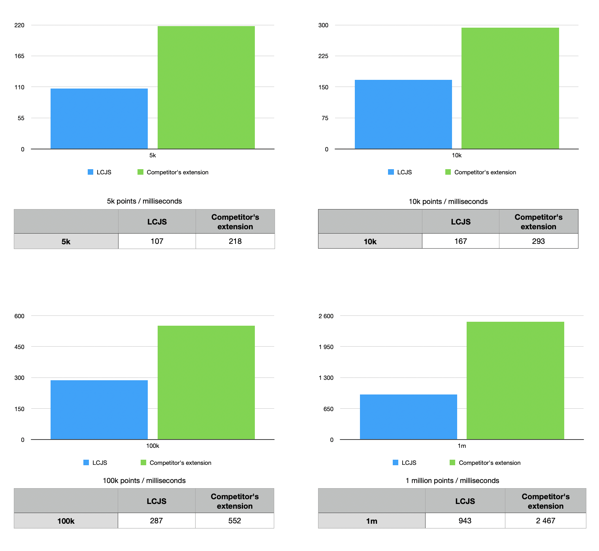

This Qlik extension was made by [lightningChart.js](https://www.arction.com/lightningchart-js/).

 

# About LightningChart.js

 

LightningChart JS is a **WebGL-based**, cross-platform charting library that has been developed for delivering the world’s highest performance.

LCJS one of the fastest JS charts in the world.  
It shows [700 times better performance](https://www.arction.com/wp-content/uploads/JavaScript%20charts%20performance%20comparison%20-%20line%20charts%20%28May%202021%29.pdf) on high-end desktop than average competitor and 100 times faster than nearest competitors.
 * Static line charts can visualize up to **[500 millions points](https://www.arction.com/javascript-charts-performance-comparison/)**
 * Real-time line charts can handle over **[10 million data points per second](https://www.arction.com/javascript-charts-performance-comparison/)**

With our library you can create different types of charts, such as XY, 3D, map, gauge, polar, heatmaps and [even more](https://www.arction.com/lightningchart-js/) with unmatched performance level

 

# About Extension

 

**This extension was tested with 1 million pooints**

This extension example lets you create XY chart and stlye it.
You can reference to our code to improve the extension to suit your needs, or use it as is.

With this  extasion you can: 

* Select type of Series :

   * **Line Series**

   

   * **Point Line Series**

   

   * **Point Series**

   

* Customize color of Line Series 

* Customize color of Points (if  Point Line Series or Point Series was selected)

* Enable/disable animation

* Set thickness of Lines/ size of Points

* Set the Title

Here is an example of customizing thickness of lines, point size, and disabling the animation

 

# Performance Comparison

Here are results of comparison LCJS performance with one of competitor's extension.
The graph shows time (in miliseconds) of loading chart with data. Smaller is better

 

# Installation

**NOTE!**

**Qlik Sense Desktop does not support WebGL**  and there is a significant performance hit. To get the maximum performance, use Qlik Cloud or a browser (http://localhost:4848/hub)

To install extension, place folder with sected Extesion to C:\Users\<User Name>\Documents\Qlik\Sense\Extensions 
or in QlikCloud ***/qlikcloud.com/console/extensions/ ->  'Add' and upload ZIP folder`

To use extension in QlikCloud go to ****/qlikcloud.com/explore/spaces/all and press  'Add new'

