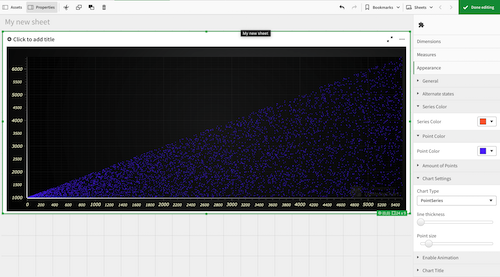

This Qlik extension was made by [lightningChart.js](https://www.arction.com/lightningchart-js/).

LCJS one of the fastest JS charts in the world and can easily render **[10 millions points](https://www.arction.com/javascript-charts-performance-comparison/)**
With our library you can create different types of charts, such as 3D, map, gauge, polar, XY and [even more](https://www.arction.com/lightningchart-js/)

**LightningChart JS** is [700 times faster](https://www.arction.com/javascript-charts-performance-comparison/) than average competitor and 100 times faster than nearest competitors.

This extension example lets you create XY chart and stlye it.
You can reference to our code to improve the extension to suit your needs, or use it as is.

With this  extasion you can: 

* Select type of Series :

   * **Line Series**

   { width=50% height=50% }

   * **Point Line Series**

   

   * **Point Series**

   

* Customize color of Line Series 

* Customize color of Points (if  Point Line Series or Point Series was selected)

* Enable/disable animation

* Set thickness of Lines/ size of Points

* Set the Title

Here is an example of customizing thickness of lines, point size, and disabling the animation

**This extension was tested with 1 million pooints**

**[LightningChart](1) based on WebGl and will not render proprely on Sense Desktop.**
You must use a browser (http://localhost:4848/hub) or Qlik Cloud 

To install extension, place folder with sected Extesion to C:\Users\<User Name>\Documents\Qlik\Sense\Extensions 
or in QlikCloud ***/qlikcloud.com/console/extensions/ ->  'Add' and upload ZIP folder`

To use extension in QlikCloud go to ****/qlikcloud.com/explore/spaces/all and press  'Add new'

